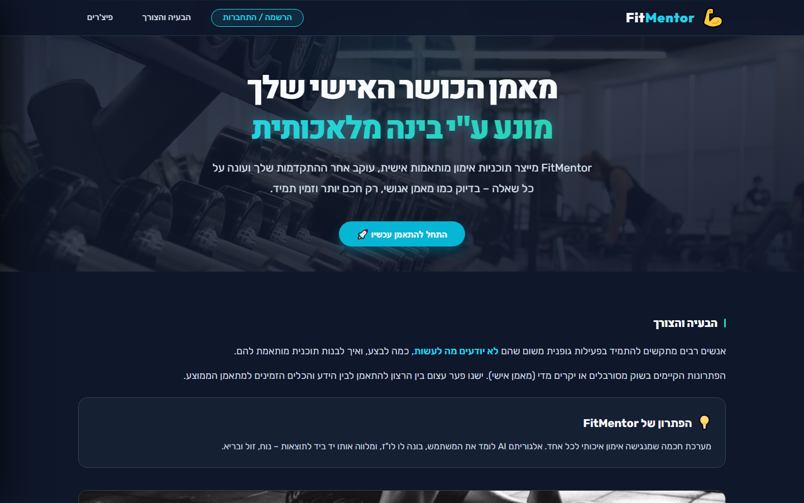

# FitMentor 💪 — AI-Powered Personal Fitness Companion



> **FitMentor** is a full-stack, AI-powered personal fitness tracking application built on a highly scalable **AWS Serverless Cloud Architecture** with a modern **React + Vite** frontend. Powered by **DeepSeek V4 Flash AI** (`deepseek/deepseek-v4-flash-0731`), FitMentor creates custom workout plans, tracks progress metrics, analyzes personal records, and provides smart training insights in Hebrew.

---

## ⚡ Tech Stack & Architecture

### 🌐 Frontend
- **Framework**: React 18 + Vite 8
- **Styling**: Modern Vanilla CSS3 with RTL (Hebrew) support, Glassmorphism aesthetics, and custom color tokens
- **Data Visualization**: Chart.js 4 (Radar, Line, & Bar charts with custom interactive plugins)
- **State & Routing**: Component-level state management with custom AuthContext & API client

### ☁️ AWS Serverless Backend
- **API Gateway**: RESTful routing endpoints (`/API`, `/Dashboard`, `/Progress`, `/TrainingLog`)
- **AWS Lambda**: Node.js ES Modules microservices handling business logic, workout calculations, and AI execution
- **AWS Cognito**: User Pools & Identity Client for secure user registration, password resets, and session management
- **AWS DynamoDB**: High-performance single-table database tracking user profiles, workout logs, plan snapshots, and system metrics
- **AI Model**: **DeepSeek V4 Flash** (`deepseek/deepseek-v4-flash-0731`) via OpenRouter with strict 20-second timeout controls and token limits

---

## ✨ Key Features

- 🏋️‍♂️ **AI Workout Generator**: Generates tailored training plans adapted to user experience, goals, and equipment.
- 🏆 **Redesigned Hall of Fame (היכל התהילה)**: Spotlight Hero PR cards, category filter tabs (*Compound, Upper, Lower*), and clean relative time badges (*היום 🔥, אתמול ⚡, לפני יומיים*).
- 📈 **Performance Analytics**:
  - **Bodyweight Trend Line**: Tracks 30-day weight progression and deltas.
  - **1RM Progress Curve**: Interactive 1RM estimation per exercise over time.
  - **Body Balance Radar**: 6-axis muscle group balance visualization with right-aligned RTL tooltips.
- 📅 **Interactive Training Log & RTL Calendar**:
  - RTL calendar with dynamic row layout (35/42 cells), centered workout indicator dots, and calorie estimation.
- 🛡️ **Executive Admin Dashboard**: User status management, user blocking, and system metric overviews.

---

## 🚀 Quick Start Guide (Install & Run from 0)

Follow these simple steps to set up and run **FitMentor** on your local machine:

### 1️⃣ Prerequisites
Ensure you have the following installed on your system:
- **Node.js** (v18.0.0 or higher): [Download Node.js](https://nodejs.org/)
- **npm** (v9.0.0 or higher, comes with Node)
- **Git**: [Download Git](https://git-scm.com/)

---

### 2️⃣ Clone the Repository
Open your terminal or PowerShell and run:

```bash
git clone https://github.com/OrSadof/FitMentor-AWS-App.git
cd FitMentor-AWS-App
```

---

### 3️⃣ Install Dependencies
Install all required Node.js packages for the frontend:

```bash
npm install
```

---

### 4️⃣ Environment Configuration (Optional)
The project connects out-of-the-box to the deployed AWS cloud backend. If you want to customize local environment variables, create a `.env` file in the root directory:

```env
# Frontend AWS Configuration
VITE_API_BASE_URL=https://8wc1g61715.execute-api.il-central-1.amazonaws.com/prod
VITE_COGNITO_USER_POOL_ID=il-central-1_LE4IUUsso
VITE_COGNITO_CLIENT_ID=4plltfjisgm4f7rjc9ijncmnps
```

---

### 5️⃣ Launch the Application
Start the local development server:

```bash
npm run dev
```

Open your browser and navigate to:
👉 **`http://localhost:3000`**

---

## 📁 Repository Structure

```
FitMentor-AWS-App/
├── public/                  # Public static assets & favicon
│   ├── landing.png          # Homepage banner preview
│   └── favicon.svg          # Application icon
├── src/                     # React Application Code
│   ├── api/                 # FitMentor API client & AWS connectors
│   ├── assets/              # Branding images & vector graphics
│   ├── pages/               # Application Views
│   │   ├── DashboardPage.jsx      # Main dashboard & AI workout generator
│   │   ├── ProgressPage.jsx       # Progress analytics & Hall of Fame
│   │   ├── TrainingLogPage.jsx    # Workout logger & sets tracker
│   │   └── AdminDashboardPage.jsx # Executive admin controls
│   ├── App.jsx              # Application router & modal management
│   ├── index.css            # Global CSS design system & typography
│   └── main.jsx             # React entry point
├── projects/fitmentor/      # AWS Lambda Backend Code & SAM Templates
│   └── backend/
│       ├── src/             # Lambda handlers (dashboard, logic, progress, training)
│       └── template.yaml    # AWS SAM CloudFormation infrastructure template
├── index.html               # Main HTML document
├── package.json             # NPM dependencies & build scripts
└── vite.config.js           # Vite dev server configuration (Port 3000)
```

---

## 🔧 Production Build

To create an optimized production bundle:

```bash
npm run build
```

The compiled assets will be saved to the `dist/` directory ready for deployment to AWS S3 / CloudFront, Vercel, or Netlify.

---

## 👨‍💻 Author & Maintainer

Developed with ❤️ by **Or Sadof** ([@OrSadof](https://github.com/OrSadof)).

---
*FitMentor — Elevating your training with artificial intelligence.* 🏋️‍♂️✨
